# Manual
1. Ingreso
2. Reporte de Elementos
3. Dar de Baja a Elementos
4. Ver un Elemento 
5. Asociar Elemento a Equipo
6. Reporte de Equipos
7. Dar de Baja a Equipos
8. Ver un Equipo
9. Opcion Modificar Equipo
10. Remplazar Elemento de Equipo
11. Reporte de Laboratorios
12. Ver un Laboratorio
13. Crear un Elemento
14. Crear un Equipo
15. Crear un Laboratorio

## (1) Ingreso:
Es necesario para poder ver y utilizar todas las opciones ofrecidas
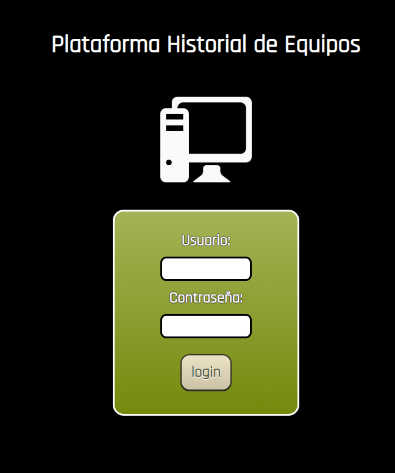

## Opciones:
Hay 6 opciones principales, en la que en cada una podra tener algunas opciones para edicion de los objetos contenidos en la aplicacion.
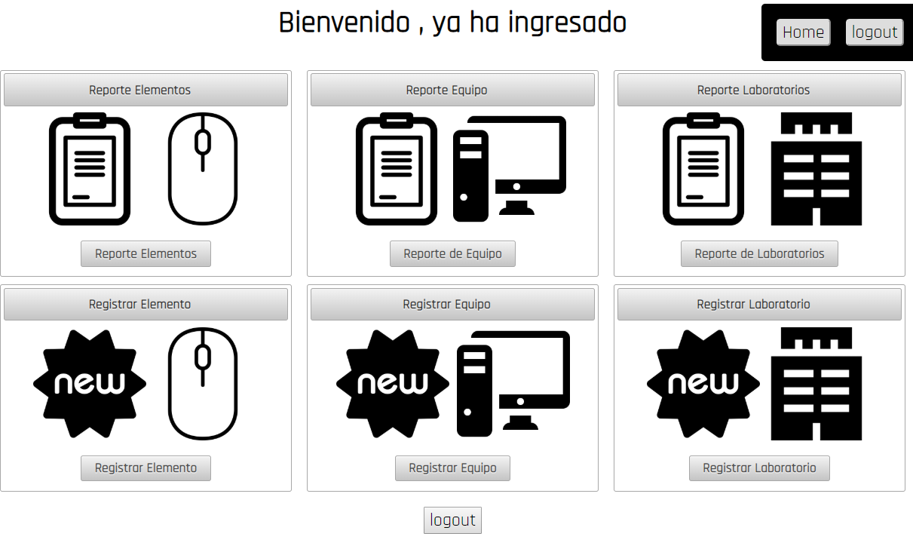

## (2) Reporte de Elementos y (3) Dar de Baja a Elementos
En el listado de Elementos se puede filtrar y organizar los elementos de la aplicacion, tambien en esta vista se pueden seleccionar elementos (en la parte inferior de la pagina ) y se puede dar la opcion de dar de baja
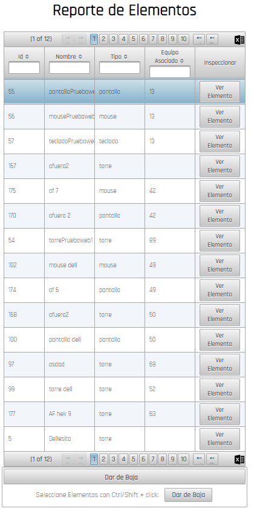

## (4) Ver un Elemento y (5) Asociar
Una vez se haya dado click en ver elemento de la anterior vista se podra ver la informacion del elemento, tambien estara la opcion de asociar a un equipo. (Aunque asociado a otro o no)
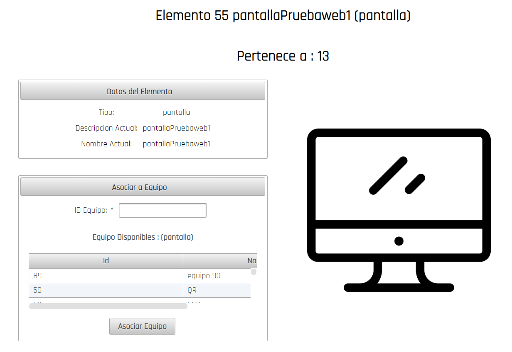

## (6) Reporte de Equipos y (7) Dar de Baja a Equipos
En el listado de Equipo se puede filtrar y organizar los elementos de la aplicacion, tambien en esta vista se pueden seleccionar equipos (en la parte inferior de la pagina ) y se puede dar la opcion de dar de baja
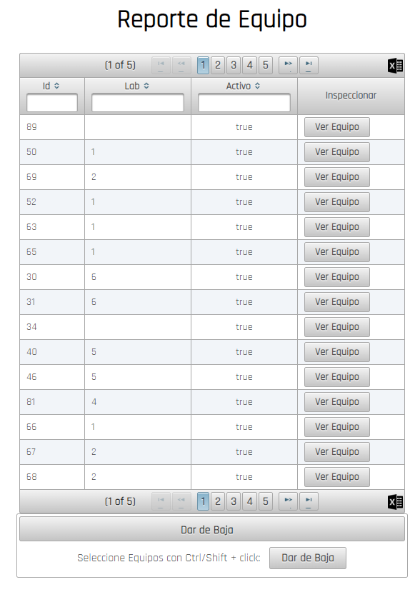

## (8) Ver un Equipo y (9) Opcion Modificar Equipo
Una vez se haya dado click en ver equipo de la anterior vista se podra ver la informacion del equipo y las opciones para modificarlo. 
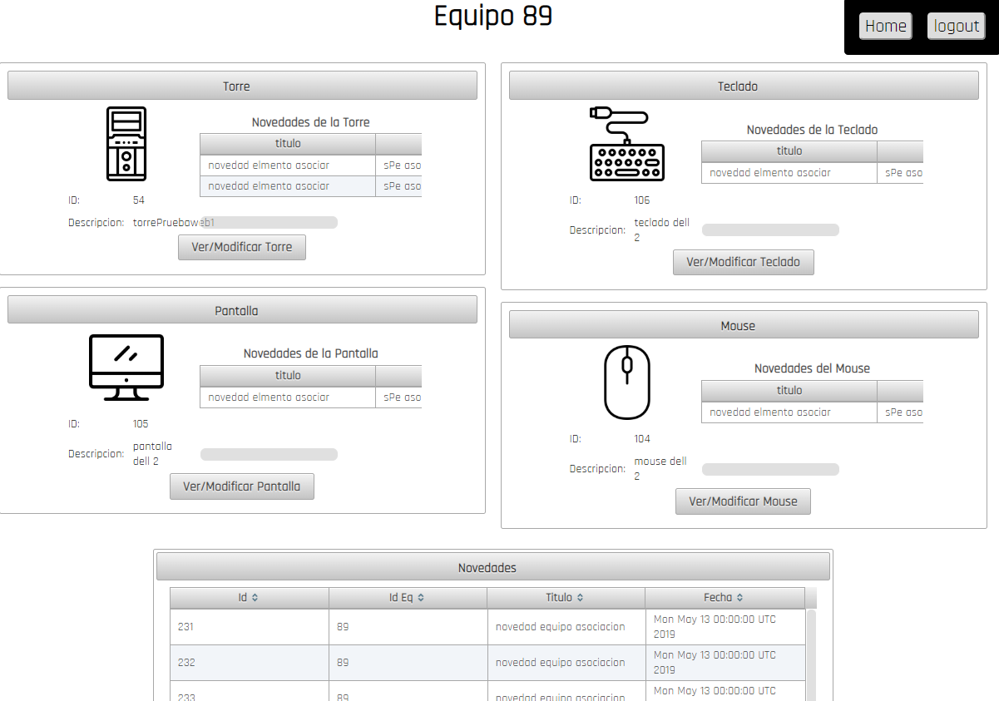

## (10) Remplazar Elemento de Equipo
Dependiendo del tipo de elemento que se haya seleccionado , en este caso una torre mostrara las torres disponibles si se quiere remplazar por una existente o si se desea rellenar los campos para crear un nuevo elemento del tipo correspondiente y asociarlo.
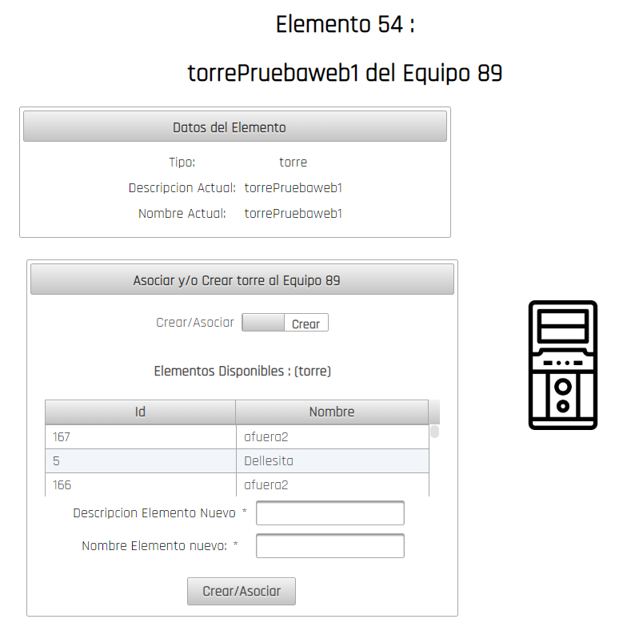

## (11) Reporte de Laboratorios
Se podra ver un reporte detallado de los laboratorios y la posibilidad de ver alguno en detalle.
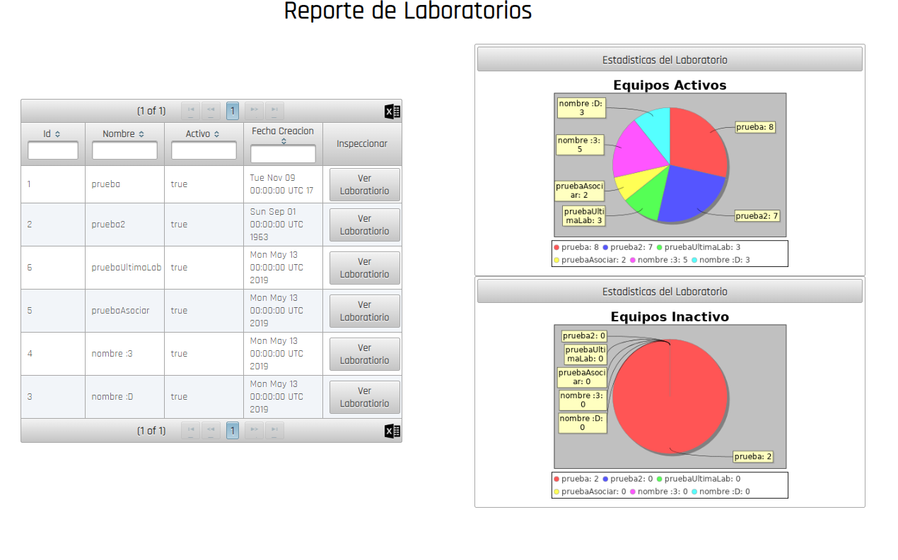

## (12) Ver un Laboratorio
Se podra ver un reporte detallado del laboratorio seleccionado en la vista anterior y la posibilidad de ver alguno en detalle.
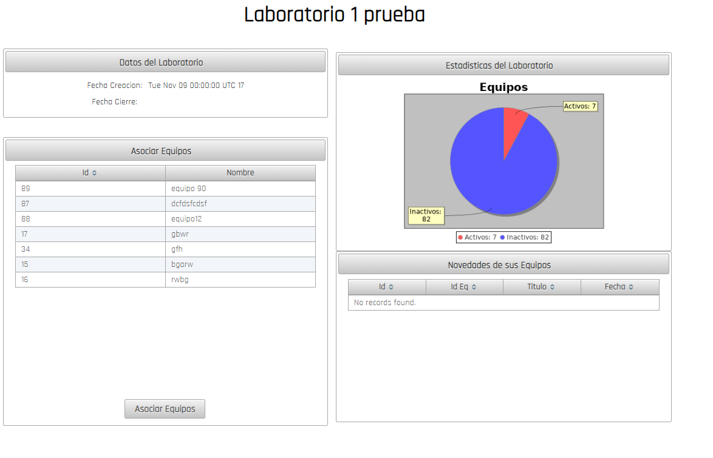

## (13) Crear un Elemento
Podra crear un elemento sin equipo asociado
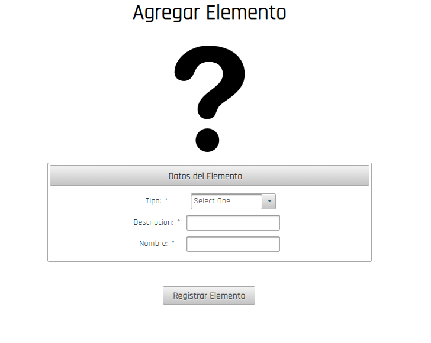

## (14) Crear un Equipo
Podra crear un equipo, con los "switchs" podra escoger si se quiere buscar y asociar o crear y asociar el tipo de elemento, obviamente estas opciones son indepentiendes , por lo tanto se puede crear un equipo asociando y creando elementos de forma simultanea. 
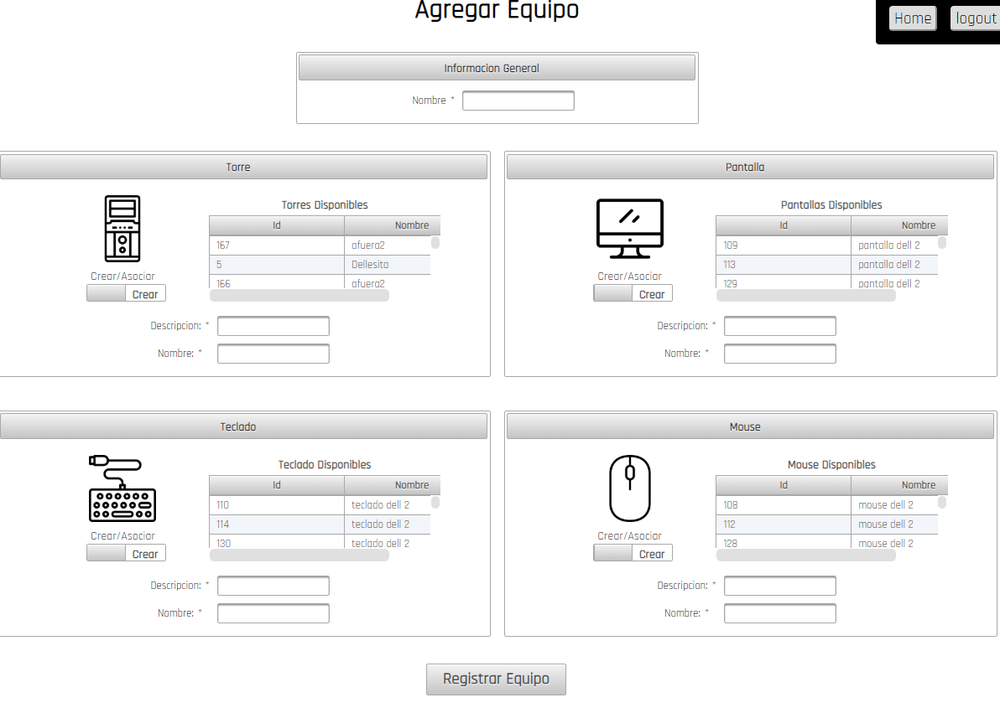

## (15) Crear un Laboratorio
Podra crear un laboratorio.
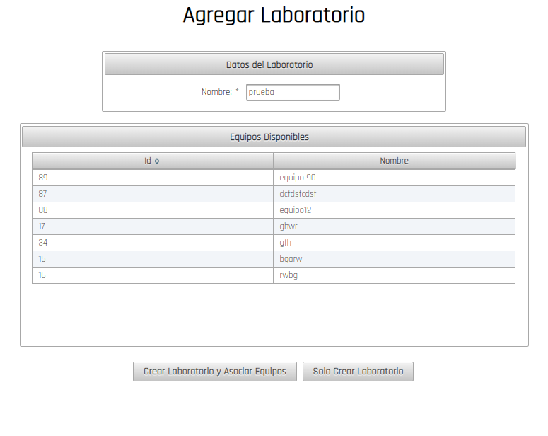

