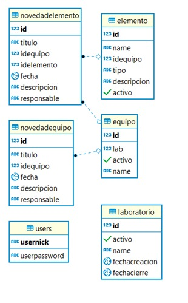

# Plataforma-Historial-Equipos

# 2019-1-Ciclos de Vida del Desarrollo de Software
## Integrantes y Roles

|     Nombre    |     Rol         |
|:--------------:|:-------------: |
|Santiago Alzate|Product Owner    |
|J Eduardo Arias|Team Developer   |
|Luis Jaramillo |Team Developer   |
|Juan P. Ospina |Team Developer   |

# Descripción del producto.
### Descripción 
Este proyecto tiene como finalidad aplicar los conocimientos adquiridos en la materia CVDS en 
una problemática presentada en el laboratorio de informática, generando una aplicación web capaz 
de llevar control sobre todos equipos del laboratorio, teniendo presente la composición física y 
la relación con los laboratorios. Además, se generan novedades, estadísticas con la finalidad de 
representar de mejor forma el manejo del laboratorio.

### Manual de usuario
[Manual](Manual.md)

### Credenciales
+ Usuario: admin
+ clave: 12345

# Arquitectura y Diseño detallado
### Modelo E-R

### Diagrama de clases

### Descripción de la arquitectura
+ PrimeFaces: correspondiente a la capa de presentación, lo utilizamos para el front de nuestra aplicación web
+ Guice: Es un framework de inyección de dependencias, lo utilizamos en nuestras dependencias, como por ejemplo los DAO.
+ QuickTheories: Es utilizado para genera datos, lo tulizamos bastante en los test
+ PostgreSQL: Es un sistema de gestión de base de datos orientado a objetos, lo utilizamos para nuestra base de datos.
### [URL HEROKU](https://historial-equipos-app.herokuapp.com/)  
### [Integración Continua (CircleCI)](https://circleci.com/gh/teamajo/Plataforma-Historial-Equipos)

# Descripción del proceso
#### Integrantes
|     Nombre    |     Rol         |
|:--------------:|:-------------: |
|J Eduardo Arias|Team Developer   |
|Luis Jaramillo |Team Developer   |
|Juan P. Ospina |Team Developer   |
#### Metodologia
Se utilizo la metodologia Scrum, con el fin de realizar el proyecto de una manera organizada,
ya que andes de que comience un nuevo Spring el qeuipo debe planear que se debe realizar en 
el tiempo presupuestado del Spring. Ademas, se realiza una retroalimentacion diaria y por cada
tramo completado. Dando asi un mejor orden de desarrollo con mejoracion continua del grupo.
La herramienta utilizada para el desarrollo del scrum es Taiga.

#### Enlace a Taiga
+ [Enlace a Taiga](https://tree.taiga.io/project/qsarjp-historial-de-equipos-labinfo/backlog)

#### Release-burndown chart

Puntos faltantes:
+ Dar de baja laboratorio.
+ novedades laboratorio.
+ Ver equipos de laboratorio.
+ Mejorar Excepciones. 
 
#### Springs
[Detalle de los Springs](img/Springs.md)

#### Reporte de pruebas

#### Reporte de análisis estático de código
[URL Codacy](https://app.codacy.com/app/AriasAEnima/Plataforma-Historial-Equipos?utm_source=github.com&utm_medium=referral&utm_content=teamajo/Plataforma-Historial-Equipos&utm_campaign=Badge_Grade_Dashboard) 

