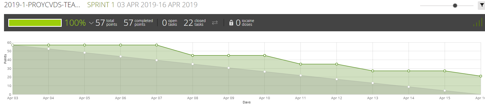
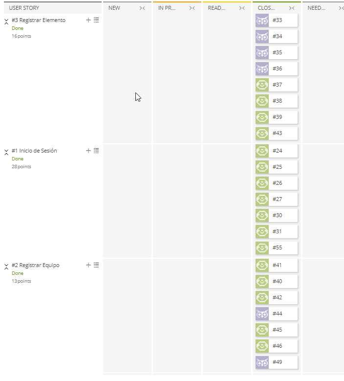
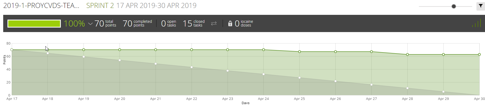
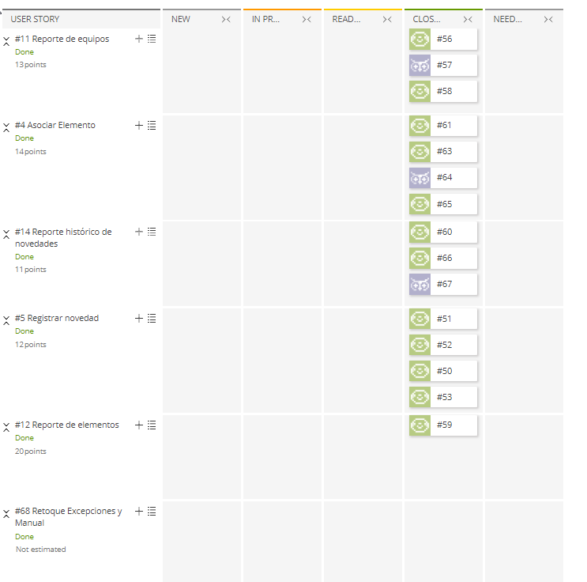
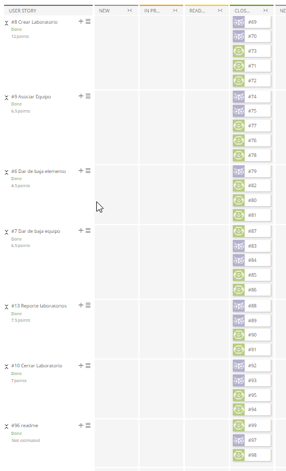

# Sprints
### Sprint 1
**Sprint-backlog**\

**Sprint-burndown chart**\

##### Resumen del sprint
El primer spring tuvimos dificultades al momento de ver la funcionalidad de shiro por lo que dejamos
muy pocos puntos en ese spring con la finalidad de entenderlo. Además hubo dificultades al momento de 
realizar algunas tareas presupuestadas en el spring y toco corregirlas en el segundo.

### Sprint 2
**Sprint-backlog**\

**Sprint-burndown chart**\

##### Resumen del sprint
En este spring tuvimos varias dificultades, Comenzamos tarde debido a los arreglos del spring 1, se
tuvo varias dificultades en las novedades de equipo y elemento. Además, no hubo un seguimiento 
continuo para el proyecto, dando así varios retrasos para el tercer spring.

### Sprint 3
**Sprint-backlog**\

**Sprint-burndown chart**\

##### Resumen del sprint
Para este sprint, aunque comenzamos a tiempo, se comnezo a trabajar cosas del anterior spring y algunas
modificaciones que impedian seguir con las actividades, auqnue al final se lograron realizar varias cosas
no se cumplio con la finalidad del proyecto faltado con 4 cosas que son mecionadas en README.
